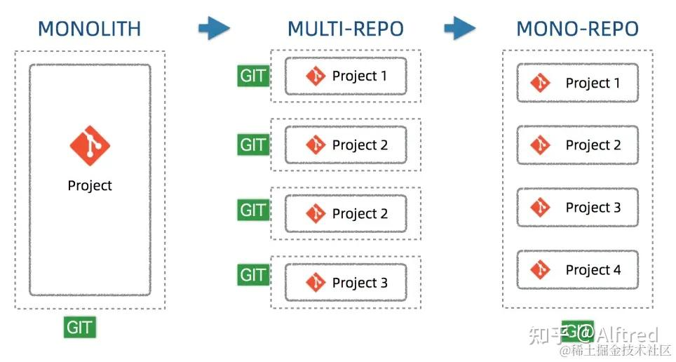

# mini-group

# monorepo

Monorepo 是一种项目开发与管理的策略模式，它代表"单一代码仓库"（Monolithic Repository）。在 Monorepo 模式中，所有相关的项目和组件都被存储在一个统一的代码仓库中，而不是分散在多个独立的代码仓库中，这些项目之间还可能会有依赖关系

# what is monorepo?

# 单一代码库的好处
乍一看，单一代码库和多代码库之间的选择似乎不是什么大问题，但这是一个会深刻影响到公司开发流程的决定。至于单一代码库的好处，可以列举如下：

可见性（Visibility）：每个人都可以看到其他人的代码，这样可以带来更好的协作和跨团队贡献——不同团队的开发人员都可以修复代码中的bug，而你甚至都不知道这个bug的存在。
更简单的依赖关系管理（Simpler dependency management）：共享依赖关系很简单，因为所有模块都托管在同一个存储库中，因此都不需要包管理器。
唯一依赖源（Single source of truth）：每个依赖只有一个版本，意味着没有版本冲突，没有依赖地狱。
一致性（Consistency）：当你把所有代码库放在一个地方时，执行代码质量标准和统一的风格会更容易。
共享时间线（Shared timeline）：API或共享库的变更会立即被暴露出来，迫使不同团队提前沟通合作，每个人都得努力跟上变化。
原子提交（Atomic commits）：原子提交使大规模重构更容易，开发人员可以在一次提交中更新多个包或项目。
隐式CI（Implicit CI）：因为所有代码已经统一维护在一个地方，因此可以保证持续集成[3]。
统一的CI/CD（Unified CI/CD）：可以为代码库中的每个项目使用相同的CI/CD[4]部署流程。
统一的构建流程（Unified build process）：代码库中的每个应用程序可以共享一致的构建流程[5]。

# 单一代码库的缺陷
随着单一代码库的发展，我们在版本控制工具、构建系统和持续集成流水线方面达到了设计极限。这些问题可能会让一家公司走上多代码库的道路：

性能差（Bad performance）：单一代码库难以扩大规模，像git blame这样的命令可能会不合理的花费很长时间执行，IDE也开始变得缓慢，生产力受到影响，对每个提交测试整个repo变得不可行。
破坏主线（Broken main/master）：主线损坏会影响到在单一代码库中工作的每个人，这既可以被看作是灾难，也可以看作是保证测试既可以保持简洁又可以跟上开发的好机会。
学习曲线（Learning curve）：如果代码库包含了许多紧密耦合的项目，那么新成员的学习曲线会更陡峭。
大量的数据（Large volumes of data）：单一代码库每天都要处理大量的数据和提交。
所有权（Ownership）：维护文件的所有权更有挑战性，因为像Git或Mercurial这样的系统没有内置的目录权限。
Code reviews：通知可能会变得非常嘈杂。例如，GitHub有有限的通知设置，不适合大量的pull request和code review。

